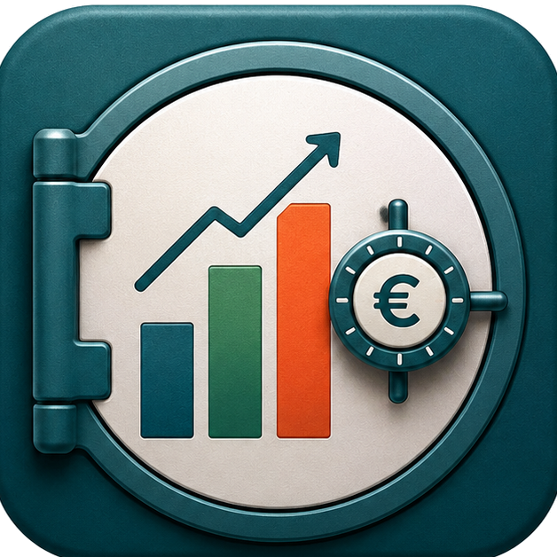
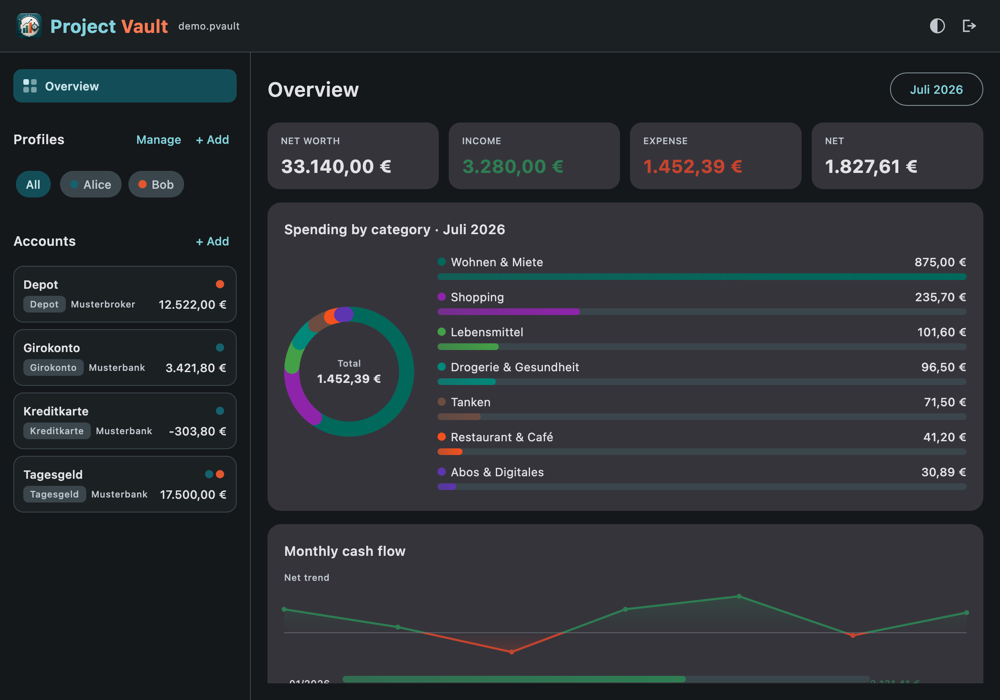
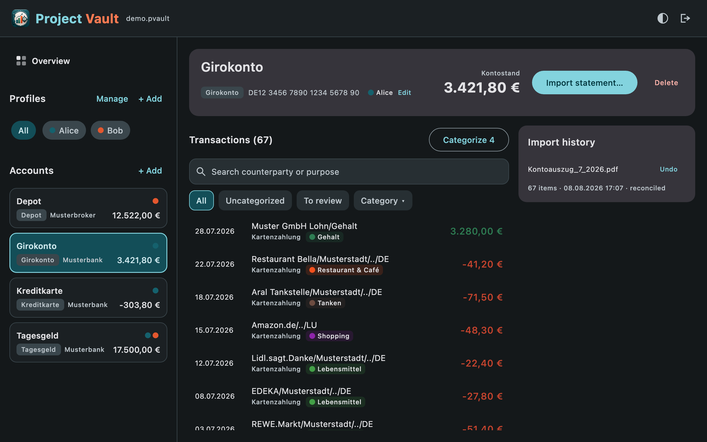
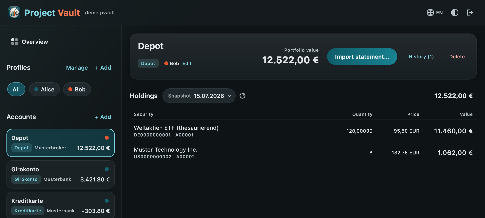
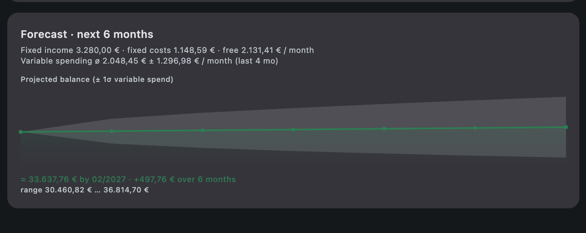

<p align="center">
  
</p>

<h1 align="center">Project Vault</h1>

**Local-first, privacy-first personal finance analyzer for the desktop.**

Import your own bank statements, get on-device categorization, spending analysis and
cash-flow forecasts — with **no bank connection** and all your data in a single portable file.

Think *Finanzguru*, but your data stays on your machine.

<p align="center">
  <a href="https://fuchss.org/projects/project-vault/"><b>Website</b></a> ·
  <a href="#features">Features</a> ·
  <a href="#getting-started">Getting started</a> ·
  <a href="#privacy">Privacy</a>
</p>



---

## Why it's different

- **No bank connection.** No PSD2, no screen-scraping, no cloud account. You import the PDF
  statements your bank already gives you.
- **On-device AI.** Transactions are categorized locally with rules + a bundled multilingual
  embedding model. Nothing is sent anywhere. (An optional local-LLM tier is on the roadmap, not yet
  built — see below.)
- **One portable vault.** Everything — profiles, accounts, transactions, categories, learned
  rules — lives in a single `*.pvault` SQLite file you can copy between your own devices.
- **Household-ready.** Multiple profiles and joint accounts from the start.
- **Native desktop.** A real Compose Multiplatform app with a bundled runtime and launcher — no
  browser, no server.

## Features

- **Statement import** with **PDF** (the primary path) and **CSV** exports flowing through one
  pipeline, so the balance check, de-dup and persistence are identical either way. **Import several
  files at once** with a single review step.
  - **PDF** — a coordinate-aware extractor with per-bank templates: **DKB** giro / Tagesgeld and
    credit-card statements, and **ING** Depot. Extensible to more banks.
  - **CSV** — **DKB** "Umsatzliste" (giro + Tagesgeld) and credit-card exports, plus the **ING**
    "Depotübersicht".
  - **Routed by account type** — a credit-card statement can't be mis-filed into a Girokonto; the
    add-account dialog shows what each account type accepts and pre-fills the bank.
  - Giro / credit-card statements get a **balance-integrity check** (opening + Σ = closing). CSV
    exports carry no opening balance, so they're shown as *not verifiable* rather than failing.
  - **Depot (Wertpapiere)** snapshots — dated holdings with market values, ISIN/WKN.
  - **De-duplication** of overlapping / re-uploaded statements — a content hash for same-source
    re-imports plus a source-independent key, so a CSV imported now and the bank's PDF later
    de-duplicate against each other.
  - Each import is a **batch** you can remove again, undoing exactly the rows it added.
- **Classification**
  - Tier 1 — deterministic keyword **rules** (seed catalog + rules you teach it).
  - Tier 2 — **embeddings** (bundled ONNX model) that *suggest* categories to review.
  - Corrections are **learned**: fixing a merchant writes a rule and, with your confirmation,
    applies to that merchant's other transactions.
  - The category picker is **filtered by amount sign** — a credit can only be income/transfer, a
    debit only expense/transfer — and a **Manage categories** dialog removes your own categories
    (built-ins are protected).
- **Profiles & accounts** — multiple household profiles with a filtering sidebar, a **Manage
  profiles** dialog (rename / delete), and inline **owner editing** to assign an account to one or
  more profiles (joint = several).
- **Live securities prices (opt-in)** — for Depot accounts, look up current prices by **ISIN** at
  Börse Frankfurt / Xetra and revalue each position (`quantity × price`), so the portfolio can be
  valued *now* instead of only as of the last Depotauszug. Off by default, enabled per account behind
  a consent dialog, and fetched **only when you press refresh** — there is no background, automatic
  or scheduled update. Each refresh is stored as its own dated snapshot you can delete again; your
  imported statement is never modified. Positions that can't be priced safely — percent-quoted bonds,
  non-EUR holdings, anything without an ISIN — keep their statement value rather than being guessed
  at. See [Privacy](#privacy) for exactly what leaves the machine.
- **Dashboard** — net worth, monthly income/expense, spending by category, monthly cash flow, with a
  month selector.
- **Recurring detection & forecasting** — finds salary/rent/subscriptions and projects the next
  months, including "freely available" income. Transfers are excluded; you can **rename or hide** any
  detected series or **add your own** (picked from an existing counterparty). The forecast rolls your
  net worth forward and estimates **non-fixed spending as ø ± 1σ** from the last 12 months, drawing a
  **cone of uncertainty** around the projected balance and warning if you could run negative.
- **Charts** — a spending donut and a **hoverable** net cash-flow trend line (green above the zero
  baseline, red below, with a sign-coloured gradient and a per-month tooltip).
- **Provenance & reversibility** — every entry traces back to its source file, statement period and
  import time; any import can be undone.
- **Fits your desktop** — a **theme toggle** (System → Light → Dark, persisted) and it **reopens the
  vault** you had open when you last quit.

## Screens

**Transactions** — categorized rows with editable categories, search/filter, and an import-history
panel where any statement can be undone. Every transaction traces back to its source file.



**Depot** — dated holdings snapshots with market values, ISIN/WKN, and the same provenance trail.
Quantity, price and value line up as a proper grid; with live prices enabled, each repriced position
also shows the time of the quote it was valued at.



**Forecast** — your net worth rolled forward six months. The central line subtracts fixed bills *and*
your average variable spending; the shaded **± 1σ cone** shows the expected range (hover any month for
its expected min/max), and a warning appears if the balance could dip below zero.



## Supported banks & account types

The bank decides how a statement is parsed, so an account is created for a **bank + account type**
picked from this table — never a hand-typed bank. Imports are then routed by both, so a statement can
only be filed into a compatible account.

| Account type | Bank | PDF | CSV |
|---|---|:--:|:--:|
| **Girokonto** (GIRO) | DKB | ✅ Kontoauszug | ✅ Umsatzliste |
| **Tagesgeld** (TAGESGELD) | DKB | ✅ Kontoauszug | ✅ Umsatzliste |
| **Kreditkarte** (KREDITKARTE) | DKB (VISA) | ✅ Abrechnung | ✅ Umsatzliste |
| **Depot** (DEPOT) | ING | ✅ Depotauszug | ✅ Depotübersicht |

The template system is extensible — more banks and layouts can be added without touching the import
pipeline, balance check or de-duplication.

## Getting started

> **Build with Temurin JDK 21.** Compose Multiplatform is not reliable on the newer JDKs that may
> be your machine default, so always point Gradle at JDK 21.

```sh
export JH=/Library/Java/JavaVirtualMachines/temurin-21.jdk/Contents/Home

JAVA_HOME=$JH ./gradlew :app:run                       # launch the desktop app
JAVA_HOME=$JH ./gradlew assemble                       # compile everything
JAVA_HOME=$JH ./gradlew test                           # run all tests
JAVA_HOME=$JH ./gradlew :app:packageDistributionForCurrentOS   # native installer (.dmg/.msi/.deb)
```

On first launch you'll get a **vault picker**: create a new `*.pvault`, add profiles and accounts,
then import a statement PDF and review the parsed rows before committing.

## Architecture

Kotlin multi-module Gradle project; a single Compose **desktop** target today, with KMP-friendly
module boundaries so a mobile companion stays possible later.

| Module | Responsibility |
|---|---|
| `:app` | Compose desktop UI — vault picker, profiles/accounts sidebar with management dialogs, transaction list with a provenance inspector, Depot view, dashboard, theme toggle, and the import review flow. Ties extraction to persistence. |
| `:core:model` | Pure-Kotlin domain types (`AccountType`, `CategoryKind`). |
| `:core:data` | SQLDelight/SQLite persistence + the portable vault (`VaultManager`, `VaultRepository`). |
| `:core:import` | PDFBox text extraction + a semicolon/latin-1-aware CSV reader, per-bank templates (DKB giro/Tagesgeld/credit-card, ING Depot in both PDF and CSV), balance/depot validators, cross-source de-dup. |
| `:core:classification` | Rules engine, seed catalog, and the bundled-embeddings classifier (DJL + ONNX Runtime). |
| `:core:analytics` | Income/expense, spending-by-category, monthly cash flow, recurring detection and forecasts. |
| `:core:quotes` | The **only networked module** — current securities prices by ISIN from Börse Frankfurt/Xetra over the JDK HTTP client, behind a provider interface that degrades to "unavailable" instead of throwing. Plus the pure `quantity × price` repricing math. |

**Toolchain:** Kotlin 2.1.20 · Compose Multiplatform 1.8.0 · Gradle 8.13 (wrapper) · JDK 21
(`jvmToolchain(21)`) · SQLDelight 2.0.2 · Apache PDFBox 3.0.4 · DJL + ONNX Runtime ·
kotlinx-serialization-json (quote parsing only).

More detail: [`docs/CLASSIFICATION.md`](docs/CLASSIFICATION.md) for the classification &
re-classification strategy, and [`docs/FORECASTING.md`](docs/FORECASTING.md) for recurring detection
and the cash-flow forecast (including the ± 1σ uncertainty cone).

## Conventions

- **Money is stored as integer minor units (cents)** — never floats.
- Entity IDs are `TEXT` UUIDs generated in Kotlin; enums persist by `name`.
- **Never commit real financial data.** `*.pvault` files (and local sample/model directories) are
  gitignored; tests use synthetic data or skip when a real sample is absent.

## Roadmap

Not built yet, but planned:

- **Classification Tier 3** — an *optional*, opt-in local **Ollama** LLM pass for the ambiguous
  remainder that rules and embeddings don't place confidently. The app is fully functional without it,
  and it would talk only to `localhost`.
- More bank PDF/CSV templates and an interactive template editor.
- **Cost basis and gains** for Depot positions — the ING Depotauszug carries an *Einstandskurs* that
  isn't imported yet; with it, live prices could show absolute and percentage return, not just a
  current value.
- **Live prices for non-EUR positions**, which currently keep their statement value because the quote
  source carries no currency and converting on a guess would be worse than not converting.

## Privacy

Project Vault makes **no network calls** to import, categorize or analyze your data — the embedding
model is bundled and runs on the CPU, and there is no bank connection, sync or cloud. Your vault file
is yours — back it up, move it, delete it. There is no telemetry, no analytics and no account.

**One feature is an exception, and it is opt-in.** Live securities prices are off by default and
enabled per Depot account behind a consent dialog that states exactly what happens. Once enabled, and
only when you press refresh:

- **What is sent:** the **ISIN** of each holding — a public identifier for the security itself, to
  `api.boerse-frankfurt.de`. One request per position. (This does tell that venue *which* securities
  you hold, though not how many or what they're worth — which is why it's a choice, not a default.)
- **What is never sent:** amounts, quantities, security names, balances, account names, IBANs,
  profiles, or anything else from your vault.
- **When:** only on your click. There is no background, automatic, scheduled or on-open fetch.
- **No account or API key** is involved, and an account that hasn't opted in never reaches the
  network at all.

Turn it off and the app is fully offline again. (The planned Ollama tier above would run locally,
talking only to `localhost`.)

## Credits & licensing

Project Vault is licensed under the **GNU GPL v3** ([`LICENSE.md`](LICENSE.md)).

On-device categorization (Tier 2) uses the **`multilingual-e5-small`** embedding model
([`Xenova/multilingual-e5-small`](https://huggingface.co/Xenova/multilingual-e5-small), an ONNX build
of [`intfloat/multilingual-e5-small`](https://huggingface.co/intfloat/multilingual-e5-small) by Wang
et al., Microsoft), bundled and redistributed under the **MIT License**. Its license text ships with
the app, and full attribution for it and the other third-party libraries is in
[`THIRD_PARTY_NOTICES.md`](THIRD_PARTY_NOTICES.md).
