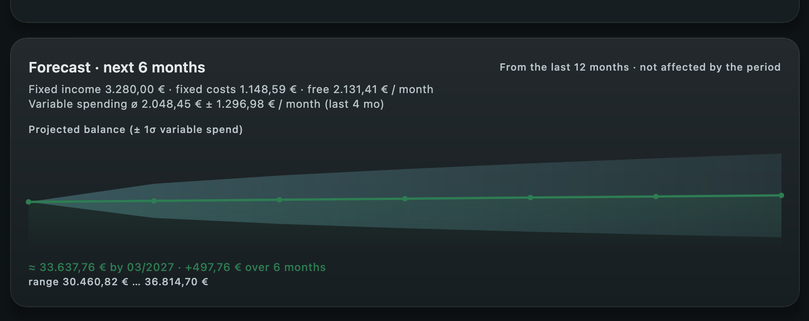

# Recurring detection & cash-flow forecasting

How Project Vault detects recurring series and projects your balance forward — deterministic and
explainable, computed on-device in `:core:analytics` (`Recurring`).

## Recurring detection

`Recurring.detect` groups transactions by a **merchant key** (first stable alphanumeric token of the
counterparty, uppercased), then splits each payer into **amount clusters** so a fixed salary isn't
merged with the same employer's bonuses. A cluster becomes a series when it has enough occurrences
(default 3) whose gaps form a regular **cadence** (monthly / quarterly / yearly) — and a *majority* of
the actual gaps must match that cadence, not just the median, so noisy "PAYPAL"/"VISA" groups don't
produce bogus series. **Transfers are excluded** (internal money movements are never a bill or income).

### Series change, and series end

A bill you pay for years is not one number. Two things happen to it, and both used to corrupt the
forecast:

**The amount changes.** Rent goes from 850 € to 910 €. Clustering is by *amount*, so a big enough rise
lands in two clusters — the old rent and the new one. Taking the median over everything would project a
rent nobody pays; leaving the clusters apart would project the old rent forever *and* hide the new one
until it has three occurrences of its own, so the rent would drop out of the forecast the month after it
went up. So `detect` **stitches clusters back together** when they cannot be two separate things: same
sign, **no overlap in time** (one ends before the other begins — a landlord charging rent *and* a
service charge every month overlaps, and stays split), and a handover no longer than three of the
earlier cluster's own gaps. Inside the stitched series the occurrences are then split **in time order**
into price levels (4 % or 2 € apart; a lone odd charge is an outlier, not a level), and the **newest
level** is the typical amount. The step is reported as an `AmountChange` — *850 € → 910 € since March* —
and shown on the recurring list, because a rent increase is worth seeing, not just worth absorbing.

**The series ends.** A subscription is cancelled, a contract runs out — and nothing announces it; the
transactions simply stop. A series is marked **inactive** when its next occurrence is more than
`cadence + 21 days` overdue: due one period after the last one, plus three weeks of grace for
billing-day drift (a bill "on the 1st" posting on the 3rd), weekend shifts and the odd skipped month.
That ends a monthly series about seven weeks after its last payment and a yearly one a year and three
weeks after — so a yearly insurance is never called dead at eleven months, when it simply isn't due yet.
Inactive series are **excluded from the forecast** and from the fixed-cost summary, and shown **dimmed**
in the recurring list as *ended · last seen March 2026* — so nothing a user was paying vanishes without
a word. They are kept there for **twice** the time it took to declare them dead (a floor of half a year,
so about six months for a monthly series and two years for a yearly one: how long a dead series is worth
looking at scales with how often it used to happen); past that the line is history and drops off. They are never deleted:
if the payment resumes, the series is live again by itself; the user can hide it for good, or add it by
hand (`recurringManual`) to keep projecting it.

The reference date for that judgement is **clamped to the newest transaction in the vault**. Statements
are imported by hand here — if the vault has not been fed for two months, every series would otherwise
look dead and the forecast would empty itself. Staleness is measured against how far the data reaches,
not against the wall clock.

**Hand-authored series are never aged out.** A manual series carries the user's own amount and next
date; the staleness rule is about detected history and does not overrule what the user declared.

Hiding a series is not a way of preserving it: a hidden series obeys the very same lifecycle, so once
it has ended and passed the point of being worth looking at, it leaves the hidden list too. It is
removed because it stopped happening, never because it was hidden — and the override stays in the
vault, so if the payments ever resume the series comes back, still hidden.

You can **rename** or **hide** a detected series, or **add your own** (selected from an existing
counterparty, so the amount comes from real data — never free text). Overrides and manual series are
stored in the vault (`recurringOverride` / `recurringManual`).

## The forecast

The forecast projects **net worth** forward six months. Each future month starts from the running
balance and applies:

1. **Fixed items** — every recurring series due that month (`Recurring.forecast`), income positive,
   bills negative.
2. **Variable spending** — everything that *isn't* a fixed bill: groceries, restaurants, one-off
   shopping, fuel, etc. `Recurring.variableMonthlySpending` sums these per calendar month over the
   **last 12 months** and reduces them to a **mean (ø)** and **population standard deviation (σ)**. An
   expense counts as "fixed" (and is excluded here) only when it matches a detected recurring *expense*
   series by merchant key **and** amount (within the detector's tolerance) — matched against **every**
   level that series has been at, and including series that have since ended, because this classifies
   *history*: last year's rent was rent, and a subscription cancelled in spring was a fixed cost in
   spring, not discretionary spending.

The **central line** = balance after fixed net *minus* the mean variable spend — a realistic
trajectory rather than one that pretends only fixed costs exist.

### The cone of uncertainty

Variable spending varies month to month, so a point estimate would be misleading. Treating each
month's variable spend as independent, variances **add**, so the ±1σ half-width of the *cumulative*
spend after `k` months is `σ·√k`. The shaded band is `central ± σ·√k` — a cone that widens the
further out you look. Hovering any month shows that month's **expected min … max**. If the band's
lower edge crosses zero, the card flags a **possible cash shortfall**.

This is deliberately simple and explainable (no hidden model): mean + standard deviation of your own
recent history, rolled forward. It answers "where is my balance likely heading, and how wide is the
plausible range?"

## Limitations

- Needs a few months of history for a meaningful σ; with one month the band collapses to the mean.
- Assumes months are independent and roughly stationary — a deliberate lifestyle change only shows in
  the *variable* part once it's in the trailing window. The 12-month cap keeps it tracking current
  habits rather than long-gone ones. A changed *fixed* bill is picked up straight away, as soon as the
  new level has two occurrences.
- Staleness is judged against the vault as a whole. If one account is imported up to date and another is
  months behind, series on the neglected account can be called ended early — they come back on the next
  import.
- Seasonality (e.g. December spending) isn't modelled yet; it's folded into σ as extra spread.
